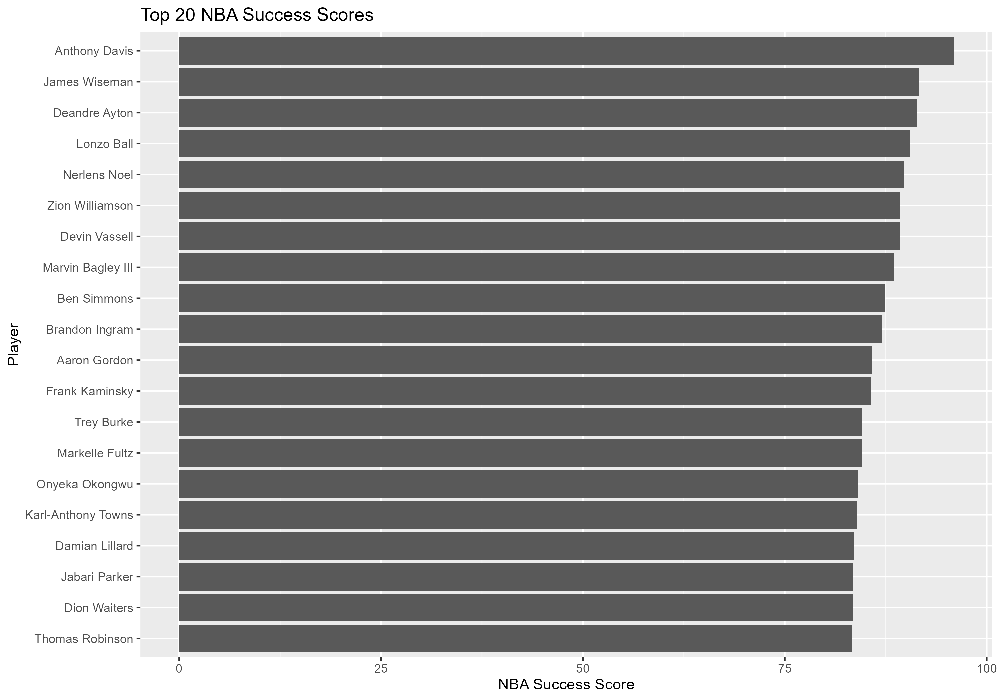
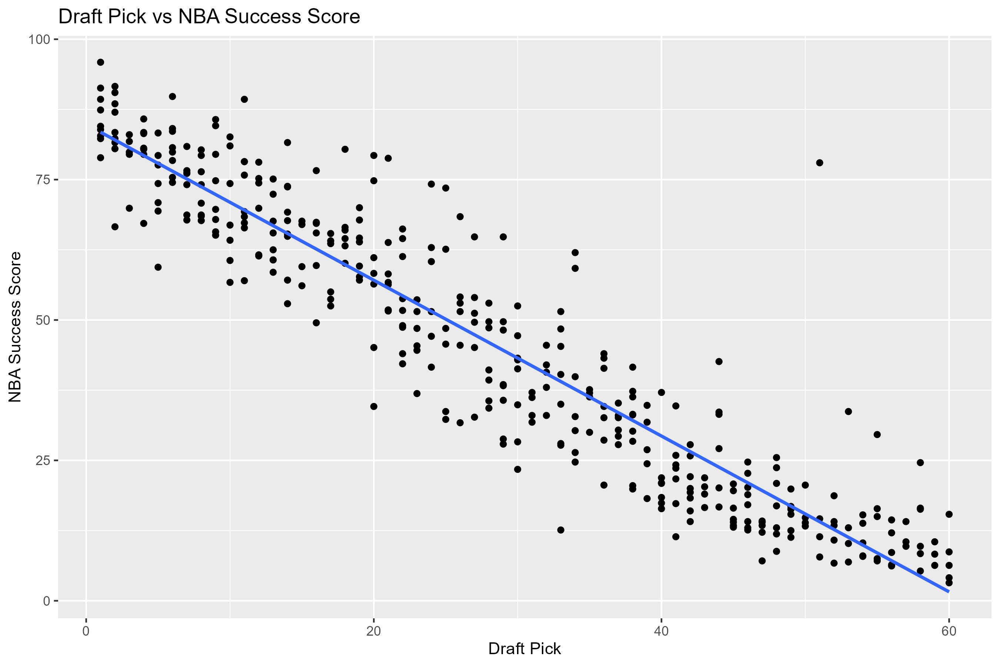
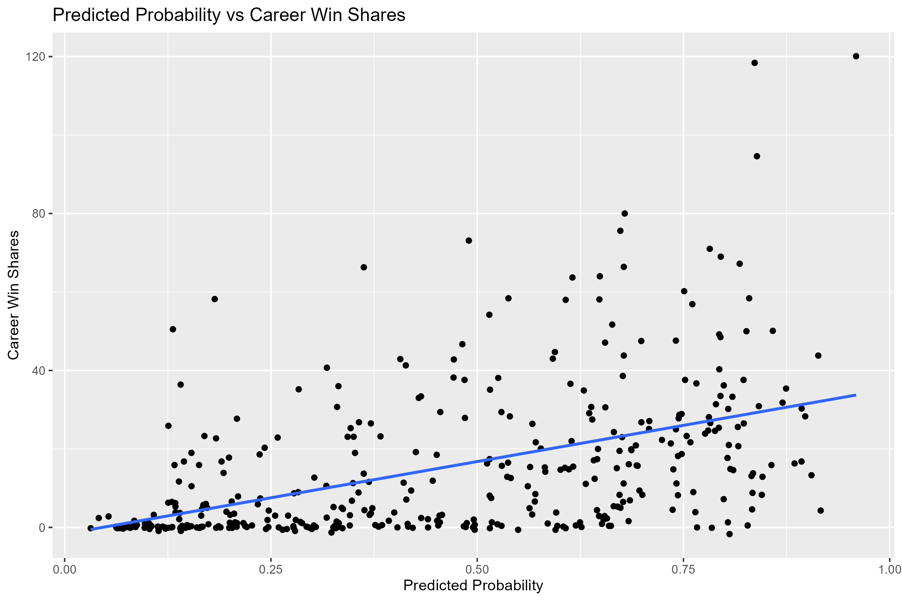
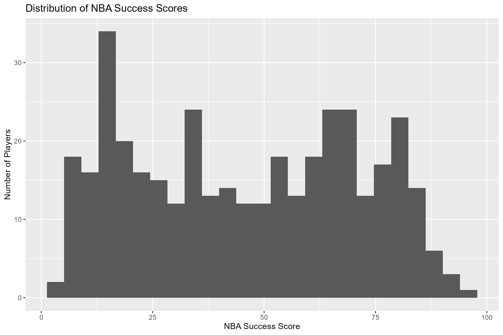
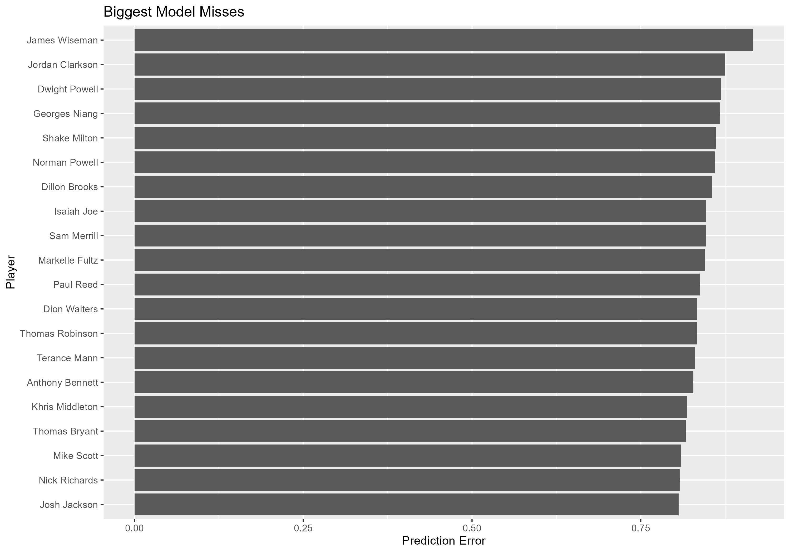

# NBA Rookie Success Model

## Project Overview

This project uses NBA draft history, college production, and physical profile data to predict whether a drafted player becomes a successful NBA player.

Success is defined as:

**Career Win Shares >= 10**

The goal is to evaluate whether pre-draft information can help identify future NBA contributors.

## Research Question

Can college production, draft position, age, height, and weight predict NBA career success?

## Data Sources

The project uses three data sources:

1. NBA Draft data  
2. College basketball production data  
3. RealGM draft measurements  

The final modeling dataset includes 382 NBA draft picks from 2012 through 2020.

## Methodology

The workflow includes:

1. Import draft, college, and physical measurement data
2. Clean and standardize player names
3. Merge datasets by player, draft year, and draft pick
4. Engineer basketball-specific features
5. Train a logistic regression model
6. Evaluate model performance
7. Export results and visualizations

## Model

The final model uses logistic regression.

Predictors include:

- Draft pick
- Draft age
- Height
- Weight
- Points per game
- Rebounds per game
- Assists per game
- Steals per game
- Blocks per game
- Assist-to-turnover ratio
- College true shooting percentage

## Model Performance

| Metric | Result |
|---|---:|
| Accuracy | 73.3% |
| Precision | 70.9% |
| Recall | 70.9% |
| ROC AUC | 0.791 |
| AIC | 444.69 |

## Key Findings

- Draft position was the strongest predictor of NBA success.
- Assist-to-turnover ratio was the most consistent college performance indicator.
- Adding too many engineered features increased multicollinearity and reduced interpretability.
- The final model balanced performance, simplicity, and basketball interpretability.

## Visualizations

### Top 20 NBA Success Scores

### Draft Pick vs NBA Success Score

### Predicted Probability vs Career Win Shares

### NBA Success Score Distribution

### Biggest Model Misses

## Limitations

This model uses only pre-draft information. It does not account for injuries, team fit, coaching, player development, role changes, or off-court factors after the draft.

## Future Improvements

Future versions could include:

- Advanced college metrics such as usage rate and assist percentage
- Multi-class career outcome tiers
- Career Win Shares regression
- Train/test validation by draft year
- Interactive Shiny dashboard

## Tools Used

- R
- dplyr
- readxl
- ggplot2
- broom
- yardstick
- pROC
- writexl