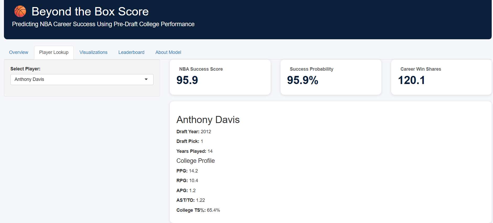

  

# 🏀 Beyond the Box Score

### Predicting NBA Career Success Using Pre-Draft College Performance

---

# 🚀 Live Dashboard

### 👉 Explore the interactive dashboard here:

https://yfazp7-danny-thompson.shinyapps.io/nba-rookie-success-model/

## Dashboard Preview

---

## Executive Summary

This project develops an end-to-end predictive analytics model that estimates the probability of NBA career success using only information available before the NBA Draft.

Using historical NBA Draft, college basketball, and physical measurement data, the model predicts whether a player will reach **10 or more Career Win Shares**, providing a quantitative framework for evaluating draft prospects.

The project also includes an interactive Shiny dashboard that allows users to explore player projections, model outputs, and visualizations.

---

## Research Question

Can pre-draft information—including college production, draft position, age, height, and weight—predict long-term NBA success?

---

## Data Sources

- NBA Draft History
- NCAA College Statistics
- RealGM Draft Combine Measurements

**Final Dataset**

- 382 NBA Draft Picks
- 2012–2020 NBA Drafts

---

## Methodology

1. Import and clean multiple basketball datasets
2. Standardize player names
3. Merge draft, college, and measurement data
4. Engineer basketball-specific features
5. Train a logistic regression model
6. Evaluate model performance
7. Build an interactive Shiny dashboard

---

## Model Variables

The final model includes:

- Draft Pick
- Draft Age
- Height
- Weight
- Points Per Game
- Rebounds Per Game
- Assists Per Game
- Steals Per Game
- Blocks Per Game
- Assist-to-Turnover Ratio
- College True Shooting Percentage

---

# Model Performance

| Metric | Result |
|---------|-------:|
| Accuracy | **73.3%** |
| Precision | **70.9%** |
| Recall | **70.9%** |
| ROC AUC | **0.791** |
| AIC | **444.69** |

---

# Interactive Dashboard

The project includes a fully interactive Shiny dashboard featuring:

- Player Lookup
- NBA Success Score
- Probability of Success
- Career Win Shares
- Interactive Leaderboard
- Model Explanations
- Project Visualizations

---

# Visualizations

## Top 20 NBA Success Scores

## Draft Pick vs Success Score

## Probability vs Career Win Shares

## Success Score Distribution

## Biggest Model Misses

---

# Key Findings

- Draft position was the strongest predictor of NBA success.
- Assist-to-turnover ratio was the strongest college performance metric.
- Simpler models outperformed more complex feature sets.
- Logistic regression provided strong interpretability while maintaining predictive performance.

---

# Limitations

The model intentionally uses only pre-draft information and does not account for:

- Injuries
- Team fit
- Coaching
- Player development
- Role changes
- Off-court factors

---

# Future Work

- Evaluate the 2026 NBA Draft Class
- Historical player comparisons
- Prospect similarity scores
- Career Win Shares regression model
- Expanded Shiny dashboard features

---

# Tools Used

- R
- Shiny
- dplyr
- ggplot2
- readxl
- broom
- yardstick
- pROC
- DT
- writexl
